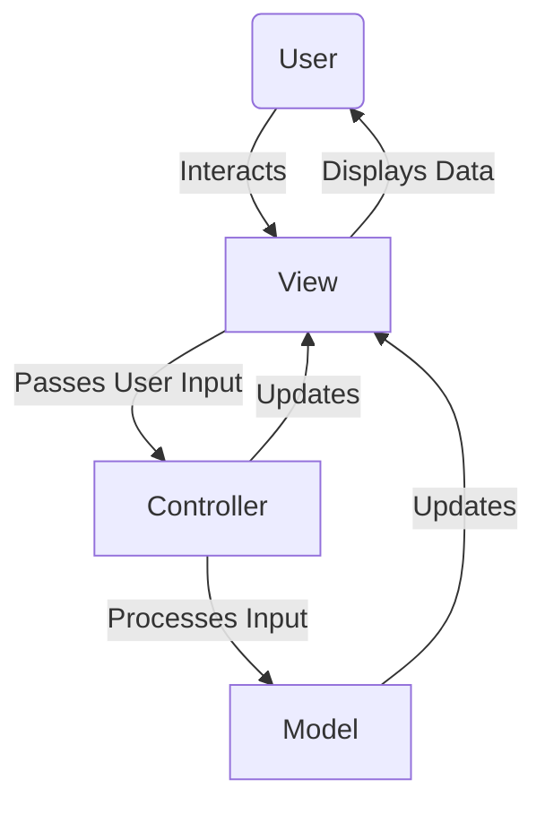
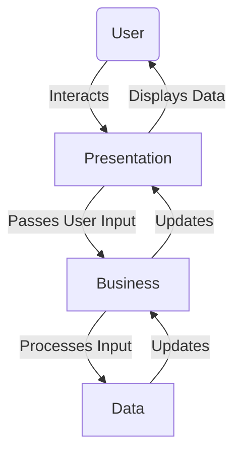
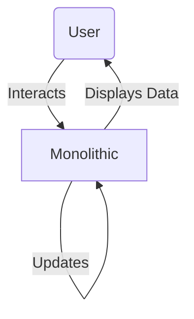
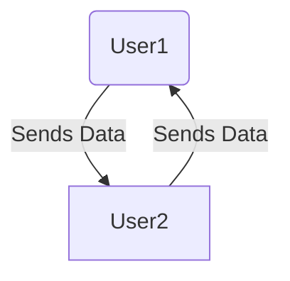
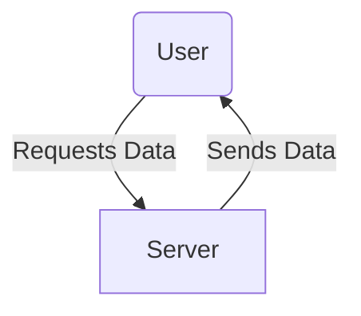

# 5. Architectural design patterns - MVC, Multitier, Monolithic, P2P, Client/Server

## MVC

- **MVC** - Model-View-Controller
    - **Model** - Data, která se zobrazují
    - **View** - Zobrazuje data
    - **Controller** - Zpracovává uživatelské vstupy

- 

### Komunikace mezi vrstvami

- User Interaction s View
    - User interacts s view, tj. kliká na tlačítko, zadává text, atd.
- View získá data z User input
    - View získá data z User input a předá je Controlleru
- Controller zpracuje data z View
    - Controller zpracuje data z View
    - Rozhodne, co se má stát na základě těchto dat
- Controller updatne Model
    - Controller updatne Model na základě dat od Usera
- Model updatne View
    - Model updatne View, aby zobrazil nová data
- View si vyzvedne data z Modelu
    - View si vyzvedne data z Modelu a zobrazí je uživateli
- Controller updatne Viwe
    - Controller updatne View, aby zobrazil nová data
- View zobrazí data uživateli
    - View zobrazí data uživateli

- **Výhody**
    - **Separace zájmů** - Každá vrstva má jiný zájem
    - **Testovatelnost** - Každá vrstva je testovatelná samostatně
    - **Rozšířitelnost** - Každá vrstva je rozšířitelná samostatně
    - **Změny** - Změny v jedné vrstvě neovlivní ostatní vrstvy
- **Nevýhody**
    - **Složitost** - Může být složité implementovat
    - **Duplikace kódu** - Může dojít k duplikaci kódu

## Multitier

- **Multitier** - Rozdělení aplikace do více vrstev, každá má svůj úkol a bere se jako service.

- 

- **Vrstvy:**
    - **Presentation Tier** - Zobrazuje data uživateli
    - **Business Logic Tier** - Zpracovává data
    - **Data Tier** - Ukládá data
    - **Communication Tier** - Komunikuje s jinými systémy

- **Výhody**
    - **Separace zájmů** - Každá vrstva má jiný zájem
    - **Testovatelnost** - Každá vrstva je testovatelná samostatně
    - **Rozšířitelnost** - Každá vrstva je rozšířitelná samostatně
    - **Změny** - Změny v jedné vrstvě neovlivní ostatní vrstvy
- **Nevýhody**
    - **Složitost** - Může být složité implementovat

## Monolithic

- **Monolithic** - Všechny části aplikace jsou v jednom celku.

- **Výhody**
    - **Jednoduchost** - Jednoduché na implementaci
    - **Rychlost** - Rychlejší než multitier
    - **Testovatelnost** - Snadnější testování
- **Nevýhody**
    - **Škálovatelnost** - Špatná škálovatelnost
    - **Rozšířitelnost** - Špatná rozšířitelnost
    - **Změny** - Změny v jedné části mohou ovlivnit celou aplikaci
    - **Testovatelnost** - Testování celé aplikace najednou
    - **Složitost** - Složité na údržbu
    - **Špatná organizace** - Špatná organizace kódu

## P2P

- **P2P** - Peer-to-Peer, kde každý uživatel je zároveň serverem a klientem.

- 

- **Výhody**
    - **Škálovatelnost** - Dobrá škálovatelnost
    - **Rychlost** - Rychlé přenosy dat
    - **Bezpečnost** - Bezpečnostní výhody
- **Nevýhody**
    - **Špatná organizace** - Špatná organizace kódu
    - **Bezpečnost** - Bezpečnostní rizika
    - **Špatná škálovatelnost** - Špatná škálovatelnost
    - **Složitost** - Složité na implementaci

## Client/Server

- **Client/Server** - Klient požaduje data od serveru a server mu je poskytuje.

- 

- **Typy:**
    - **Thin Client** - Klient má minimální funkce a většina je na serveru
    - **Thick Client** - Klient má většinu funkcí a server je pouze pro data
    - **Hybrid Client** - Kombinace Thin a Thick Client
- **Vrstvy:**
    - **Client** - Klient, který požaduje data
    - **Server** - Server, který poskytuje data
    - **Database** - Databáze, kde jsou data uložena
- **Výhody**
    - **Škálovatelnost** - Dobrá škálovatelnost
    - **Bezpečnost** - Bezpečnostní výhody
    - **Rychlost** - Rychlé přenosy dat
- **Nevýhody**
    - **Složitost** - Složité na implementaci

