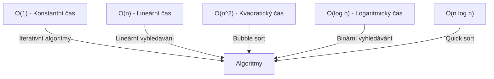
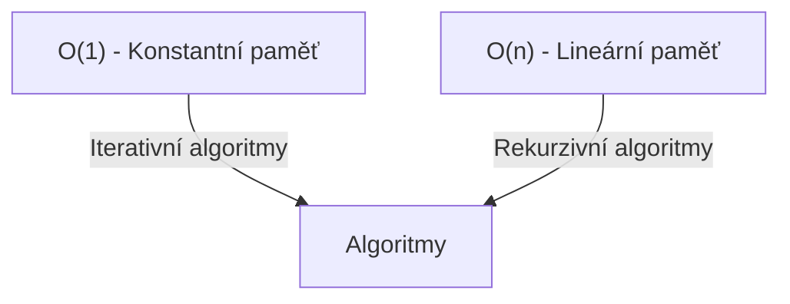

# 6. Asymptotické paměťové a časové složitosti

Asymptotická složitost je způsob, jakým popisujeme výkonnost algoritmů v závislosti na velikosti vstupních dat. Můžeme
se zaměřit na časovou složitost (kolik času algoritmus potřebuje k provedení) nebo na paměťovou složitost (kolik paměti
algoritmus vyžaduje).

## Big O Notation

Big O Notation je nejběžnější způsob, jak popsat časovou složitost algoritmu. Popisuje, jak se doba běhu algoritmu mění
s velikostí vstupních dat.

- **O(1)** - Konstantní čas: Nezáleží na velikosti vstupu, doba běhu je vždy stejná.
- **O(n)** - Lineární čas: Doba běhu roste lineárně s velikostí vstupu.
- **O(n^2)** - Kvadratický čas: Doba běhu roste kvadraticky s velikostí vstupu.
- **O(log n)** - Logaritmický čas: Doba běhu roste logaritmicky s velikostí vstupu.

- 
## Příklady algoritmů a jejich časové složitosti

- **Lineární vyhledávání** - O(n): Procházíme pole prvků jeden po druhém.
- **Binární vyhledávání** - O(log n): Pole musí být seřazeno. V každém kroku se velikost problému sníží na polovinu.
- **Bubble sort** - O(n^2): Pro každý prvek v poli procházíme pole a porovnáváme sousední prvky.
- **Quick sort** - O(n log n): Vybereme pivot a rozdělíme pole na dva podle toho, zda jsou prvky menší nebo větší než
  pivot.

## Paměťová složitost

Paměťová složitost popisuje, kolik paměti algoritmus vyžaduje. Stejně jako časová složitost, i paměťová složitost může
být konstantní (O(1)), lineární (O(n)), kvadratická (O(n^2)), logaritmická (O(log n)) atd.

- **Iterativní algoritmy** - O(1): Tyto algoritmy obvykle vyžadují konstantní množství paměti, protože nevytvářejí nové
  kopie dat.
- **Rekurzivní algoritmy** - O(n): Tyto algoritmy obvykle vyžadují více paměti, protože vytvářejí nové kopie dat pro
  každé rekurzivní volání.

